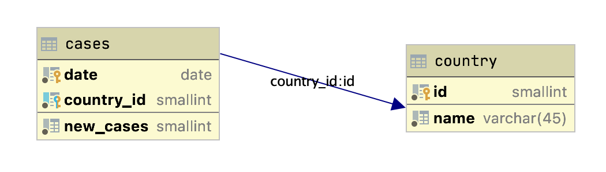

# Docker and databases hands-on exam 

This exam will check the basic knowledge of Docker and databases during the course Introduction to Data Science.

Your goal is to solve the following tasks:

## 1. Database Docker image

Implement file `mysql/Dockerfile` that will be based on the official Docker image `mysql:8.0`. When the container starts, the scripts in folder `mysql/scripts/*` should be automatically executed. 

Build image using a tag name `mysql`.

The scripts include the creation of a simple database. It's schema looks as follows:



## 2. Notebook Docker image

Implement file `jupyter/Dockerfile` that will be based on the official Docker image `jupyter/datascience-notebook:python-3.8.6`. Within the Dockerfile also install dependencies for programatic usage of MySQL database (e.g. for python you might install `mysql-connector-python`).

Build image using a tag name `jupyter`.

## 3. Docker compose

Compose the above images (`mysql` and `jupyter`) in a docker compose file (`docker-compose.yml`). Connect both images using a bridge network, named `jupyter-network`. 

Additional parameters for the `mysql` image:

* Restart the container if the database service stops working.
* Set the default password for the `root` user to `Geslo.01`. 

Additional parameters for the `jupyter` image:

* Restart the container if the database service stops working.
* Set the image dependent of the `mysql` image.
* Map the container port `8888` to host port `8888`.
* Set the environment variable `NB_USER` to `jupyter`.
* Map folder `notebooks` to container's folder `/home/jovyan`.

## 4. Build and run images

Implement script `build.sh` where you should build both images and run the environment using the docker-compose command. 

## 4. Prepare data
You are provided with the Italian and USA covid-19 cases data from the [Benford’s Law and COVID-19 reporting](https://www.sciencedirect.com/science/article/pii/S0165176520303475) study. You already know the Italian part of data from Hands-on exam 1. 

In Jupyter notebook you can directly work with Excel file (`Benford_Covid_Data.xlsx`) or you can export data to CSV files and work with them within the `notebook` folder. You can also do manual cleaning at this step if you prefer.

## 5. Database querying

When the containers are running, navigate to the jupyter notebook service offered by a `jupyter` container (link should be printed out in the container logs). Create a new notebook in a `/home/jovyan` folder named `{FIRST-NAME_LAST-NAME.ipynb}` (John Doe would name his notebook as `John_Doe.ipynb`).

In the notebook, implement the following:

1. Setup connection `covid` database (if you just start containers, observe Docker logs to make sure that sakila database is loaded).
2. Delete all data from tables `country` and `cases`.
3. Insert countries `Italy` and `USA` into the database.
4. Load the data from Excel/CSV files and store it to database. Note the following:
	* Check the date formats and use them correctly.
	* Character `.` (dot) is a thousand separator.
	* Set negative values to 0. Be careful as some values use - or – as a negative sign.
5. Implement query A: Print country name, date, region and cases from the database.
	Expected output format:
	
	```
	('Italy', datetime.date(2020, 1, 31), 'ABR', 666)
	('Italy', datetime.date(2020, 1, 31), 'BAS', 43432)
	('Italy', datetime.date(2020, 1, 31), 'BZ', 343)
	('Italy', datetime.date(2020, 1, 31), 'CAL', 343)
	```
6. Implement query B: Print country name, date and number for cases where number of cases is maximum for each country (use only one SQL statement).
	
	Expected output format:
	
	```
	('Italy', 235, datetime.date(2040, 3, 24))
	('USA', 663, datetime.date(2023, 6, 16))
	```
7. Implement query C: Print first digit of new cases and its occurence number for Italian data. Do not take zeros or other values into account. Order results ascending based on first digit. (hint: you may need to use [MySQL substring function](https://dev.mysql.com/doc/refman/8.0/en/string-functions.html#function_substring))

	If everything is okay, you should get the same numbers as Italy, Full Sample row in Table 3 (source: [https://www.sciencedirect.com/science/article/pii/S0165176520303475](https://www.sciencedirect.com/science/article/pii/S0165176520303475)). 
8. Implement query D: Print first digit of new cases and its relative number (percentage) for USA data. Do not take zeros or other values into account. Order results ascending based on first digit.
	
	Expected output format:
	
	```
	('1', Decimal('0.3333'))
	('2', Decimal('0.6666'))
	('3', Decimal('0.1111'))
	.....
	```
3. Close connection to the database.
4. Run all cells and save the notebook, so that the results will be visible if someone opens your notebook later.

## 6. Double-check your work & submit

Go through the instructions again and make sure you implemented everything as requested. Save all the files, include them into git (double check if everything is included) and push your work to the remote repository. Apart from the saved files make sure you included Excel/CSV files and Jupyter notebook in the appropriate path.

When your submission is graded, `build.sh` script will be executed. Then Jupyter notebook will be opened by the link provided by `jupyter` container. Your implemented notebook should be visible there and everyhing need to be runnable from beginning to the end.
