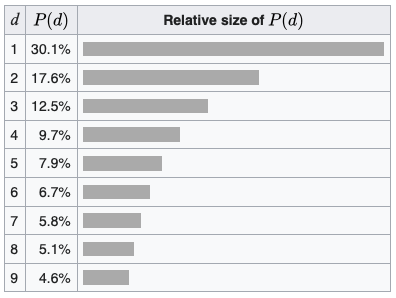
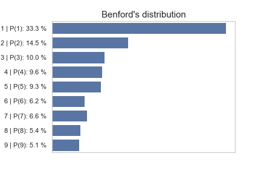

# Python hands-on exam 

This exam will check the basic knowledge of Python during the course Introduction to Data Science.

Update the marked parts in this document with your answers.

## 1. Environment setup

Before you start working on the task, create an empty environment (e.g. using conda or virtualenv) which you will use for the tasks below. Also, create an empty Jupyter notebook using the Python from your environment.

<mark>
```
conda create -n ds_exam python=3.8
conda activate ds_exam
conda install jupyter notebook
conda install nb_conda
```</mark>

<mark></mark>


## 2. Calculate Benford's law numbers

[Benford's law (1938)](https://en.wikipedia.org/wiki/Benford%27s_law) is an observation about the frequency distribution of leading digits in many real-life sets of numerical data. The law states that in many naturally occurring collections of numbers, the leading digit is likely to be small. For example, in sets that obey the law, the number 1 appears as the leading significant digit about 30% of the time, while 9 appears as the leading significant digit less than 5% of the time. If the digits were distributed uniformly, they would each occur about 11.1% of the time. Benford's law also makes predictions about the distribution of second digits, third digits, digit combinations, and so on.

It has been shown that this result applies to a wide variety of data sets, including electricity bills, street addresses, stock prices, house prices, population numbers, death rates, lengths of rivers, and physical and mathematical constants. [Researchers published a study](https://www.sciencedirect.com/science/article/pii/S0165176520303475) where they show that COVID-19 cases in China, Italy and U.S. follow Benford's law. Contrary to popular speculation, researchers found no evidence that the Chinese massaged their COVID-19 statistics as the distributions match with others.


### 2.1 Calculate a Benford's number

A set of numbers is said to satisfy Benford's law if the leading digit `d` (`d ∈ {1, ..., 9}`) occurs with probability of the following formula for base 10:


Create a function called `benford` that is able to calculate the formula above and takes one digit as input.

What is the result of the function for number 7?

It is <mark>benford(7) = 0.058</mark>

### 2.2 Get the first digit for a given number

For the analysis you need to get the first digit for a given number. For example, leading (or first or significant) digit for a number `8923` is `8`.

Create a function called `leading_digit` that returns the leading digit for a given number.


### 2.3 Import Italian COVID-19 data

Researchers mentioned above, published some data regarding COVID-19 cases in China, Italy and U.S.. We have prepared the Italian part of data for you in a CSV file called `Italy_COVID19.csv`. Each line show a number of new cases for each of the Italian's region for a specific date. 

Import that data using Python (e.g. you can use standard Python library or Pandas library).

Using Python identify on which date and in which region the most new cases were identified. List all dates and regions if multiple exist with that maximum number. 

The maximum number of identified new cases in a specific day is <mark>3251</mark>

This number was achieved on the following day(s) and region(s): <mark>21.03.2020 in LOM</mark>


## 3. Benford's distribution

Following the Benford's distribution the leading digits would have the following distribution:



Calculate the distribution for leading digits from the given Italian COVID-19 data. Use all the dates and regions. Help yourself with a function you created in 2.2. Draw a distribution graph, similar as you see above (horizontal, include digit and its percentage on the vertical axis) and include it in this document (*HINT: the easiest way would be to find a similar graph example in matplotlib library*). 

*NOTE: Take only positive numbers into account.*

Resulting plot:

<mark></mark>

Do you think the numbers follow the Benford's law (just answer what you think, without any code or statistical analysis)?

<mark>Yes, I do think the numbers follow Benford's distribution, but because we have a small 
dataset, on our plot we don't get a distribution exactly matching Benford's distribution.</mark>

## 4. Export Italian COVID-19 data

Within the task above you already got all the numbers (maybe you will need to redefine your code a bit). Using Python generate a CSV file called `Italian_leading_digit_distribution.csv` with a header which looks as follows:

```
Leading digit, Occurences, Percent
1,326,0.332653061
2,142,0.144897959
3,98,0.1
4,94,0.095918367
5,91,0.092857143
6,61,0.062244898
7,65,0.066326531
8,53,0.054081633
9,50,0.051020408
```

## 5. Make your work reproducible

During your work you may have used some libraries that need to be installed prior running your code. Export a list of your dependencies into the *environment.yml* (or *requirements.txt*) file and add it to the repository.

## 6. Double-check your submitted work

Go through the instructions again and make sure that you implemented everything as requested and also pushed everything to the remote repository. Especially check the following:

* Your code works in general.
* You updated all the marked parts (yellow) of this *README.md*.
* You added Jupyter notebook, `Italian_leading_digit_distribution.png`, `Italian_leading_digit_distribution.csv` and dependencies file to the repo.